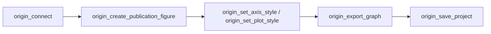

# originpro-mcp

[中文](README.md) | English

An OriginPro MCP server for AI coding assistants (Antigravity, Codex, Claude Desktop, Cursor, etc.). It automates OriginLab OriginPro via its Windows COM Automation interface, enabling high-speed tabular data import, publication-grade scientific chart creation, multi-layer formatting, and lossless image/project export.

## 🌟 Key Features & Performance Highlights

- **Native COM SafeArray Fast-Path**: `origin_put_worksheet` and `origin_get_worksheet` leverage 2D COM SafeArray transfers, achieving over 50x higher throughput (injecting tens of thousands of data points in seconds).
- **Non-Interactive Batch Mode**: Automatically injects `@N=1; @V=1; doc -s;` to suppress modal prompts, dialog popups, and UI screen redraws during execution.
- **Full Path Support**: Supports both Windows absolute paths (e.g. `D:\Desktop\project.opju`) and workspace-relative paths, including cross-drive access.
- **Path Escaping Safety**: Built-in LabTalk path backslash escaping prevents Windows paths from failing due to `\t` (tab) or `\n` (newline) interpretation.
- **PowerShell 7 Auto-Detection**: Prioritizes PowerShell 7 (`pwsh`), gracefully falls back to system `powershell.exe`, and features built-in execution timeout guards.
- **One-Click Journal Themes & Combo Charts**: Includes presets for `nature`, `science`, `cell`, and `journal` color palettes and dual-Y column+line plot generators.

## Prerequisites

- **OS**: Windows (Origin COM Automation is Windows-only).
- **OriginLab OriginPro**: Installed and activated (Origin 2021 or newer recommended).
- **Node.js**: Node.js 20 or higher.

## 📦 Installation & Deployment

### Option 1: Install Globally from GitHub (Recommended)

```powershell
npm install -g github:noc228076/Origin-Pro-mcp-codex
```

Verify that the command is available in any terminal:

```powershell
originpro-mcp
```

### Option 2: Build from Source

```powershell
git clone https://github.com/noc228076/Origin-Pro-mcp-codex.git
cd Origin-Pro-mcp-codex
npm install
npm run build
npm link
```

## ⚙️ Client Configuration

### 1. Antigravity / Gemini (`mcp_config.json`)

Add to `mcpServers` in `C:\Users\<YourUser>\.gemini\config\mcp_config.json`:

```json
{
  "mcpServers": {
    "originpro": {
      "command": "node",
      "args": [
        "D:\\APPS\\AIMCP\\origin-pro-mcp-codex\\dist\\index.js"
      ],
      "env": {
        "ORIGIN_MCP_WORKDIR": "D:\\APPS\\AIMCP\\origin-pro-mcp-codex"
      }
    }
  }
}
```

### 2. Codex (`codex.json` / MCP Settings)

```json
{
  "type": "stdio",
  "command": "node",
  "args": [
    "D:\\APPS\\AIMCP\\origin-pro-mcp-codex\\dist\\index.js"
  ],
  "env": {
    "ORIGIN_MCP_WORKDIR": "D:\\APPS\\AIMCP\\origin-pro-mcp-codex"
  }
}
```

### 3. Claude Desktop (`claude_desktop_config.json`)

Configure in `%APPDATA%\Claude\claude_desktop_config.json`:

```json
{
  "mcpServers": {
    "originpro": {
      "command": "node",
      "args": [
        "D:\\APPS\\AIMCP\\origin-pro-mcp-codex\\dist\\index.js"
      ]
    }
  }
}
```

### 4. CCSwitch Configuration

```json
{
  "type": "stdio",
  "command": "node",
  "args": [
    "D:\\APPS\\AIMCP\\origin-pro-mcp-codex\\dist\\index.js"
  ],
  "env": {
    "ORIGIN_MCP_WORKDIR": "D:\\APPS\\AIMCP\\origin-pro-mcp-codex"
  }
}
```

## 🛠️ MCP Tools Overview (23 Tools)

### 1. Session & Lifecycle
| Tool | Description |
| :--- | :--- |
| `origin_status` | Check COM connection status and current window visibility mode |
| `origin_connect` | Attach to an existing Origin instance or launch a new one |
| `origin_set_visible` | Set Origin window state (`show`, `hide`, `front`, `maximize`, `minimize`) |
| `origin_run` | Let Origin process queued automation tasks |
| `origin_exit` | Safely disconnect COM session and terminate background PowerShell bridge |

### 2. Project File Management
| Tool | Parameters | Description |
| :--- | :--- | :--- |
| `origin_new_project` | None | Create a clean Origin project in active session |
| `origin_load_project` | `relativePath` | Open an existing `.opju` file (accepts relative or absolute path, e.g. `D:\Desktop\demo.opju`) |
| `origin_save_project` | `relativePath` | Save project to destination path (auto-creates directories) |

### 3. Worksheets & Data Transfer
| Tool | Key Parameters | Description |
| :--- | :--- | :--- |
| `origin_create_page` | `pageType`, `name`, `template` | Create window (`worksheet`, `graph`, `matrix`, `layout`, `notes`) |
| `origin_put_worksheet` | `worksheetRange`, `data`, `rowOffset`, `columnOffset` | Fast bulk write 2D array into worksheet via native COM array channel |
| `origin_get_worksheet` | `worksheetRange`, `rowOffset`, `columnOffset`, `rowCount`, `columnCount` | Fast bulk read worksheet range |

### 4. Plotting & Scientific Styling
| Tool | Key Parameters | Description |
| :--- | :--- | :--- |
| `origin_plot_xy` | `worksheetRange`, `xColumn`, `yColumns`, `plotType` | Create standard XY plots (`line`, `scatter`, `line_symbol`, `column`) |
| `origin_create_combo_chart` | `xColumn`, `columnYColumn`, `lineYColumn`, `columnColor`, `lineColor` | Generate column + line double-Y combo chart |
| `origin_create_publication_figure` | `data`, `theme`, `titles`, `exportPath`, `exportFormat` | End-to-end: data insertion, dual-Y plot, journal styling, and high-res export |
| `origin_set_plot_style` | `graphName`, `layerIndex`, `plotIndex`, `color`, `lineWidth`, `fillColor` | Fine-tune plot color, line width, symbol size, fill color |
| `origin_set_axis_style` | `graphName`, `layerIndex`, `axis`, `title`, `from`, `to`, `majorTicks`, `fontSize` | Customize X / Y / Y2 axis range, tick spacing, font size, and labels |
| `origin_apply_graph_theme` | `graphName`, `theme` | Apply journal color schemes (`nature`, `science`, `cell`, `journal`) |
| `origin_export_graph` | `relativePath`, `format`, `graphName` | High-res export (`png`, `pdf`, `tif`, `jpg`, `eps`, `emf`, supports absolute paths) |

### 5. Low-Level LabTalk Access
| Tool | Description |
| :--- | :--- |
| `origin_execute_labtalk` | Execute custom LabTalk commands with automated non-interactive guards |
| `origin_get_ltvar` / `origin_set_ltvar` | Read / write numeric LabTalk variables |
| `origin_get_ltstr` / `origin_set_ltstr` | Read / write string LabTalk variables |

## 🧭 Recommended Workflow

For scientific publication plots, prefer composite high-level tools over raw LabTalk:



## 🔧 Environment Variables

| Variable | Default | Purpose |
| :--- | :--- | :--- |
| `ORIGIN_MCP_WORKDIR` | Current directory | Workspace root for relative paths |
| `ORIGIN_MCP_TIMEOUT_MS` | `30000` | COM request timeout guard in milliseconds |
| `ORIGIN_MCP_POWERSHELL_PATH` | Auto-detected | Custom path to PowerShell executable |
| `ORIGIN_MCP_ALLOW_ABSOLUTE_PATHS` | `true` | Whether to allow cross-drive Windows absolute paths |

## 📄 License

This project is licensed under the [MIT License](LICENSE). Contributions, issues, and feature requests are welcome!
